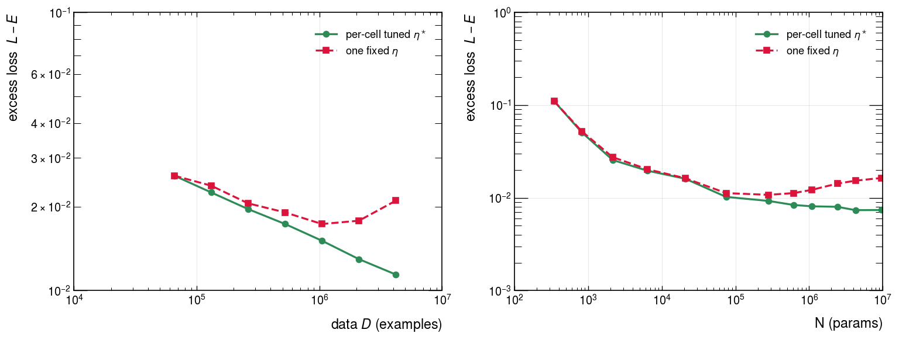
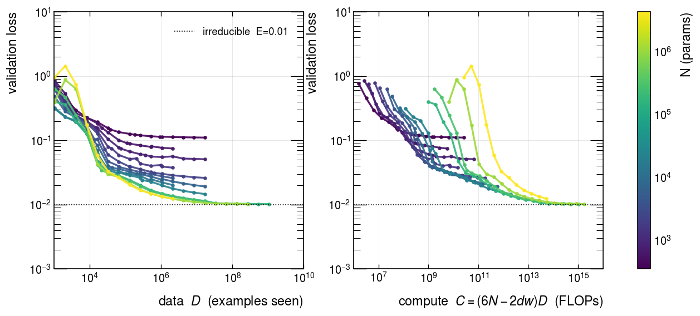
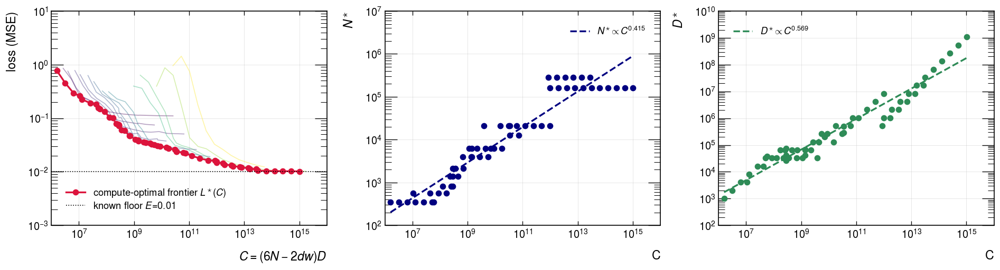
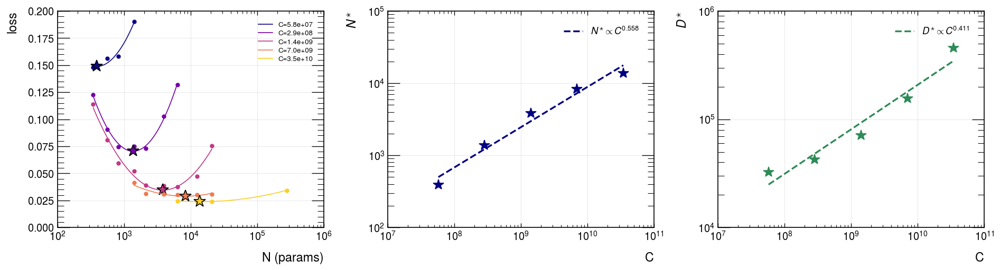
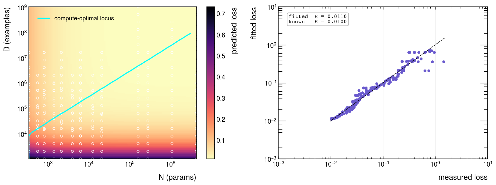
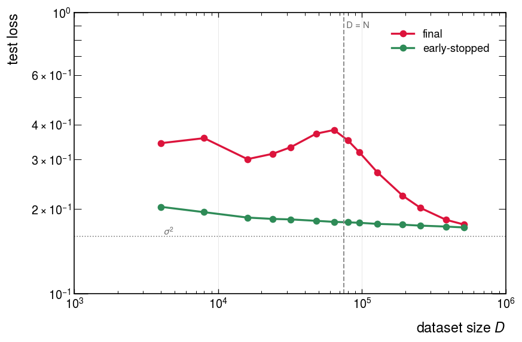
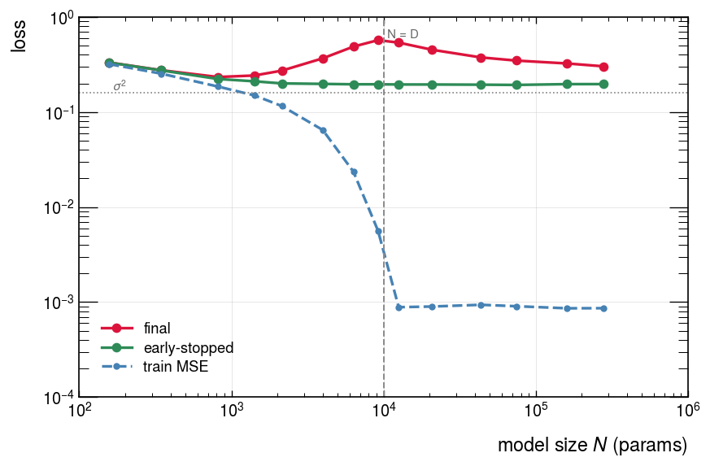
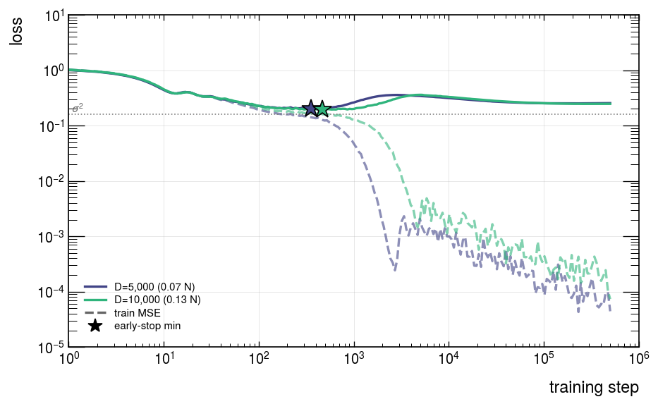
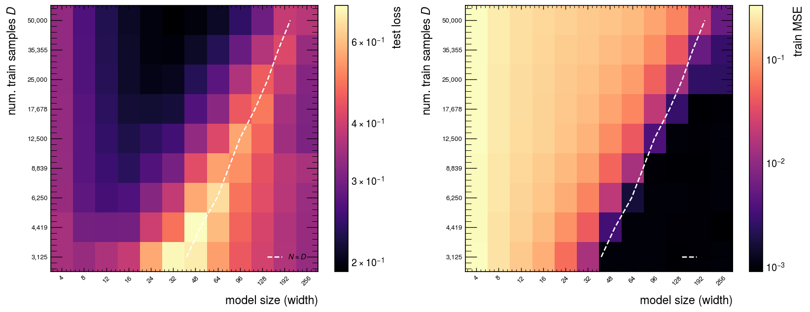

# Extracting neural scaling laws in three ways

A small, self-contained tutorial that reproduces the **three compute-optimal
scaling-law extraction methods** from the Chinchilla paper ([Hoffmann et al.,
2022](https://arxiv.org/abs/2203.15556)) on a synthetic problem you can run on a laptop: MLP
**students of increasing size** trained on a **Gaussian teacher-student** task.

A scaling law predicts how the achievable loss falls with compute[FLOPs] and how to split that compute between model size `N` (parameters) and
data `D` (examples). We count MLP compute cost as **`C = (6N − 2·d·w)·D`** (`d` = input
dim, `w` = first hidden width). This repo trains a grid over `(N, D)` and recovers the
compute-optimal frontier `L*(C)` and allocation `(N*(C), D*(C))` in three ways.

| # | method | idea | what it gives |
|---|--------|------|---------------|
| 1 | **Training-curve envelope** | lower envelope of the loss-vs-compute curves | assumption-free `L*(C)`, `N*`, `D*` |
| 2 | **IsoFLOP profiles** | at fixed `C`, sweep `N`; the loss-minimising `N` is `N*(C)` | `N*`, `D*` from parabola minima |
| 3 | **Parametric fit** | fit `L(N,D) = E + A/Nᵅ + B/Dᵝ`, frontier in closed form | full surface + floor `E` |

## The notebooks, built up in layers

A scaling analysis is really a stack of nested loops. The notebooks peel it from the inside out,
each one wrapping the previous:

| notebook | layer | what it adds | runs |
|---|---|---|---|
| [`00_single_cell`](notebooks/00_single_cell.ipynb) | a single cell | train one model of size `N` on `D` examples → one loss | live |
| [`01_tune_one_cell`](notebooks/01_tune_one_cell.ipynb) | tune one cell | sweep the LR, fit a parabola → the cell's optimum `η*` | live |
| [`02_hp_transfer_law`](notebooks/02_hp_transfer_law.ipynb) | the HP law | how `η*` scales: `η*(w,T) = η_ref·(w/w_ref)^cᵂ·(T/T_ref)^cᵀ` | loads study |
| [`03_scaling_analysis`](notebooks/03_scaling_analysis.ipynb) | the full sweep | the `(N,D)` grid (LR per cell from the law) → the frontier, three ways | loads grid |
| [`04_double_descent`](notebooks/04_double_descent.ipynb) | a different regime | repeat a *limited* dataset → double descent | loads grids |

The two cheap layers run live; the rest load grids precomputed by the scripts. The loops
themselves live in the package: `sweep.run_cell` (L0), `hp.tune_lr_cell` (L1),
`hp.fit_transfer_law` (L2), `sweep.run_grid` (L3), `approaches.*` (L4).

## Why per-cell tuning matters

A scaling law is only trustworthy if every cell is trained near its own optimal learning rate.
[`run_lr_ablation.py`](scripts/run_lr_ablation.py) makes the cost of *not* re-tuning concrete:
hold one fixed LR and scale either the data (left) or the model (right), against the
fully per-cell-tuned baseline.



The fixed-LR loss stops improving and eventually turns **up**, while the tuned curve keeps
descending; the gap grows with scale. So reading a scaling exponent off an un-tuned grid biases
it, and can hide the scaling entirely. That is why this is its own layer: notebook 02 calibrates
the transfer law `η*(w,T)`, and notebook 03 launches every grid cell at its predicted `η*`.

The same holds for **every** hyperparameter, not just the learning rate: the batch size, warmup fraction, and schedule shape all have optima that drift with model and data size, so
a fully rigorous study would tune and scale them jointly. We calibrate the learning rate (the most
impactful one) and hold the rest fixed for simplicity.

## The synthetic problem

- **Teacher**: a *fixed, randomly initialised* MLP that **defines the target
  function** (never trained). Inputs are Gaussian `x ~ N(0, I)`.
- **Student**: the MLP we **train**, of growing width (size `N`), to imitate the
  teacher.
- **Targets**: `y = teacher(x) + σ·ε`, label noise `ε ~ N(0,1)`. Data is drawn
  **fresh every step** (single-pass), so `D` = examples seen.

Under the Loss parametric form `L ≈ E + A/Nᵅ + B/Dᵝ`:

- `A/Nᵅ`: a small student cannot represent the teacher (capacity error),
- `B/Dᵝ`: too few examples to pin the function down (data error),
- `E`: label noise no model can predict.

Because the task is synthetic we **know the floor exactly**: `E = σ²`. That lets us
grade the fitted floor from Approach 3 against the truth.

## Quickstart

Install, then read the notebooks in order, starting at `00` and working up (see the table above):

```bash
pip install -e ".[notebook]"        # editable install + jupyter
jupyter notebook notebooks/         # open 00_single_cell.ipynb and go layer by layer
```

Or with [pixi](https://pixi.sh):

```bash
pixi install          # build the env from pyproject.toml
pixi run notebooks    # execute all five notebooks (00 -> 04)
```

<details>
<summary><b>Optional: regenerate the data from scratch</b> (only to reproduce the sweeps)</summary>

```bash
# 1) Calibrate the per-cell learning rate (the muP / transfer study, ~10 min CPU).
#    Writes results/hp_study_cosine.json + results/figures/hp_study_cosine.png
python scripts/run_hp_study.py

# 2) Train the (N, D) grid with each cell at its own tuned LR (~45 min CPU; the
#    default grid runs out to 17M examples). Incremental: re-running after
#    extending the data/width range only trains the new cells.
#    Writes results/sweep_cosine.csv, results/sweep_meta.json, results/teacher.pt
python scripts/run_sweep.py                 # or: --preset quick   for a fast smoke test
```
</details>

The split is deliberate: **sweeps run in scripts, visualisation lives in the
notebook.** Re-rendering the notebook is fast and deterministic because it just
reloads the cached CSVs.

## Scaling Laws



*Loss vs compute, one curve per model size: small models win at low compute,
large models take over and approach the known floor `E = σ²`.*

| Approach 1: envelope | Approach 2: IsoFLOP | Approach 3: parametric |
|:---:|:---:|:---:|
|  |  |  |

All three recover near-`√C` scaling (`N*` and `D*` grow together) and broadly
agree on the allocation; Approach 3 additionally recovers the known floor `E`.

### Double descent

The tutorial above is single-pass, so it never overfits and the loss is monotone.
A second notebook reproduces all three classic double descents
([Nakkiran et al., 2019](https://arxiv.org/abs/1912.02292)) on the same teacher-student setup:

- **Sample-wise** (`--mode samples`, vary `D`): test loss peaks near the
  interpolation threshold `D ~ N`, then second-descends.
- **Model-wise** (`--mode width`, vary `W` at fixed `D=10k`): classic U, a sharp peak
  **exactly at `N ~ D`**, then a second descent.
- **Epoch-wise** (`--mode epochs`, fixed `W,D` overparam, train long): test goes
  down (fit signal) → up (fit noise) → down (second descent), while train MSE falls
  monotonically to interpolation.

| sample-wise | model-wise | epoch-wise |
|:---:|:---:|:---:|
|  |  |  |





## References

Hoffmann, Borgeaud, Mensch et al., *Training Compute-Optimal Large Language Models*
(2022), [arXiv:2203.15556](https://arxiv.org/abs/2203.15556)

Nakkiran, Kaplun, Bansal, Yang, Barak, Sutskever, *Deep Double Descent: Where Bigger
Models and More Data Hurt* (2019), [arXiv:1912.02292](https://arxiv.org/abs/1912.02292)
