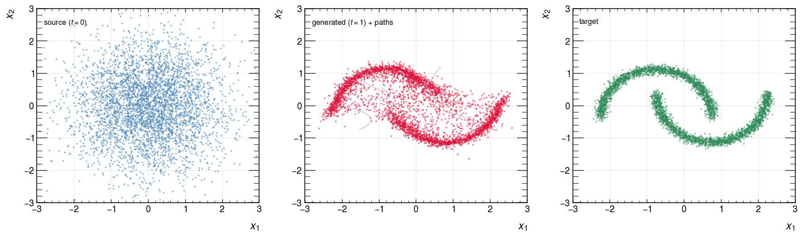
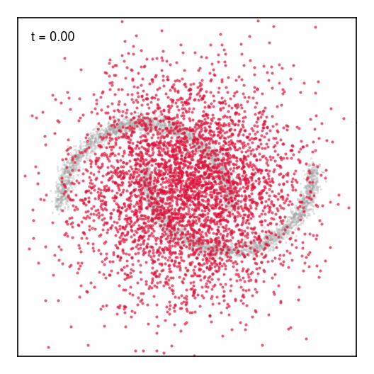
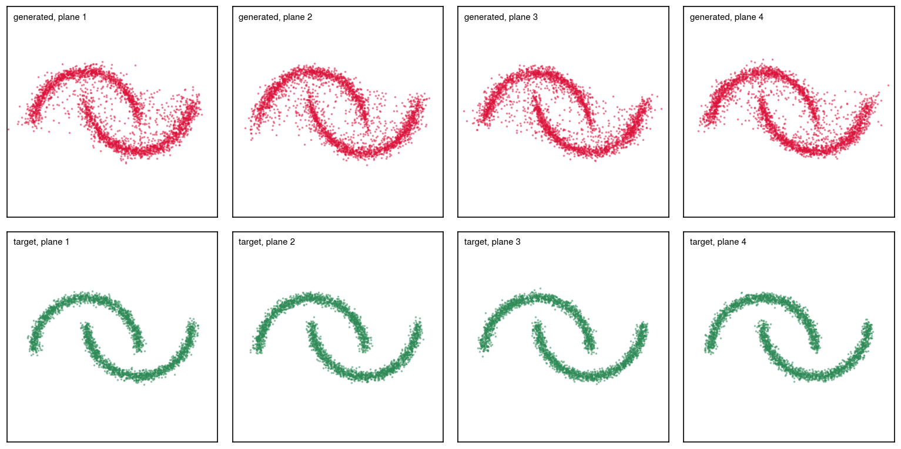
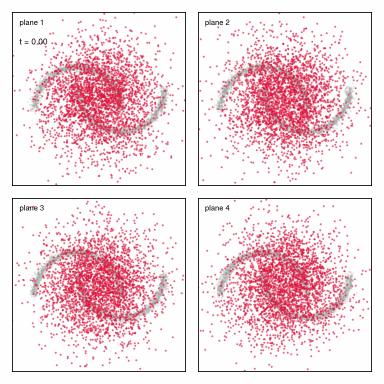
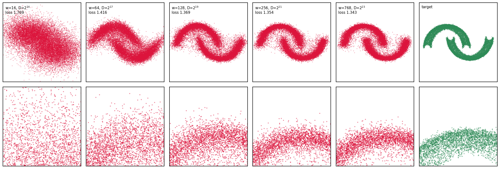
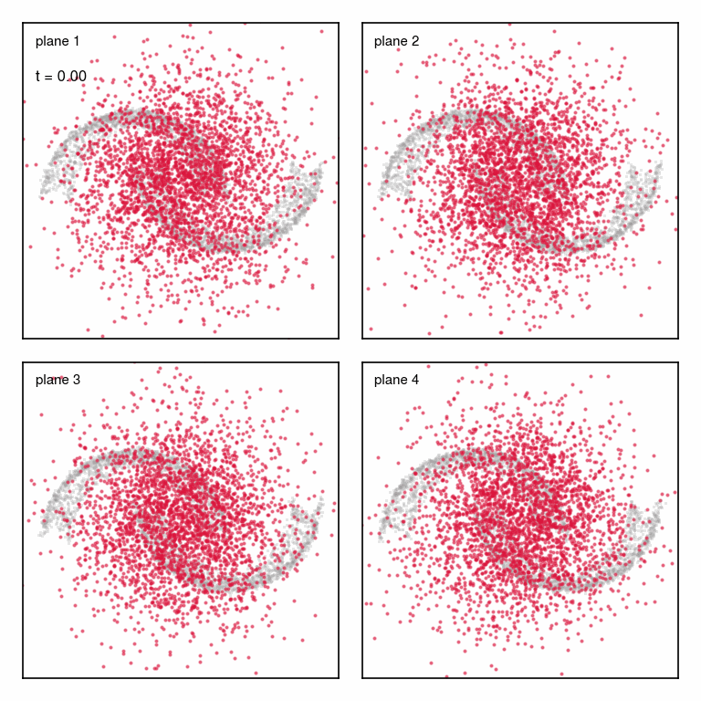
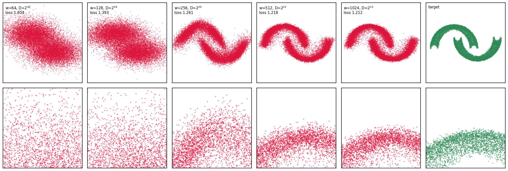
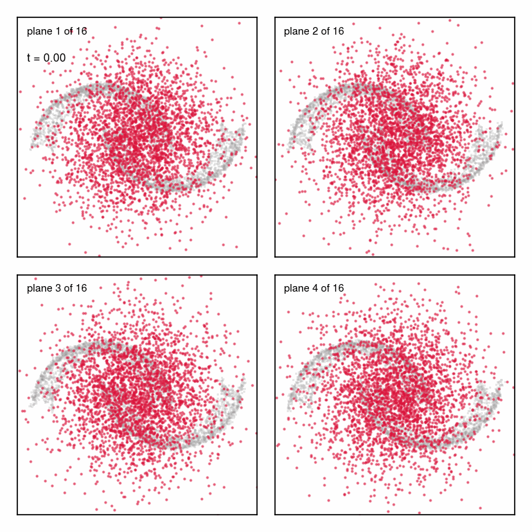

# Extracting neural scaling laws in three ways

A small, self-contained tutorial that reproduces the **three compute-optimal
scaling-law extraction methods** from the Chinchilla paper ([Hoffmann et al.,
2022](https://arxiv.org/abs/2203.15556)) on a synthetic problem you can run on a laptop: MLP
**students of increasing size** trained on a **Gaussian teacher-student** task.

A scaling law predicts how the achievable loss falls with compute[FLOPs] and how to split that compute between model size `N` (parameters) and
data `D` (examples). We count MLP compute cost as **`C = (6N − 2·d·w)·D`** (`d` = input
dim, `w` = first hidden width). This repo trains a grid over `(N, D)` and recovers the
compute-optimal frontier `L*(C)` and allocation `(N*(C), D*(C))` in three ways.

| # | method | idea | what it gives |
|---|--------|------|---------------|
| 1 | **Training-curve envelope** | lower envelope of the loss-vs-compute curves | assumption-free `L*(C)`, `N*`, `D*` |
| 2 | **IsoFLOP profiles** | at fixed `C`, sweep `N`; the loss-minimising `N` is `N*(C)` | `N*`, `D*` from parabola minima |
| 3 | **Parametric fit** | fit `L(N,D) = E + A/Nᵅ + B/Dᵝ`, frontier in closed form | full surface + floor `E` |

## The notebooks, built up in layers

A scaling analysis is really a stack of nested loops. The notebooks peel it from the inside out,
each one wrapping the previous:

| notebook | layer | what it adds | runs |
|---|---|---|---|
| [`00_single_cell`](notebooks/00_single_cell.ipynb) | a single cell | train one model of size `N` on `D` examples → one loss | live |
| [`01_tune_one_cell`](notebooks/01_tune_one_cell.ipynb) | tune one cell | sweep the LR, fit a parabola → the cell's optimum `η*` | live |
| [`02_hp_transfer_law`](notebooks/02_hp_transfer_law.ipynb) | the HP law | how `η*` scales: `η*(w,T) = η_ref·(w/w_ref)^cᵂ·(T/T_ref)^cᵀ` | loads study |
| [`03_scaling_analysis`](notebooks/03_scaling_analysis.ipynb) | the full sweep | the `(N,D)` grid (LR per cell from the law) → the frontier, three ways | loads grid |
| [`04_double_descent`](notebooks/04_double_descent.ipynb) | a different regime | repeat a *limited* dataset → double descent | loads grids |
| [`05_flow_matching`](notebooks/05_flow_matching.ipynb) | a generative problem | the same recipe on flow matching: Gaussian → two moons | live + grid |
| [`06_flow_matching_hard`](notebooks/06_flow_matching_hard.ipynb) | a harder flow | four moon-pairs entangled in $R^8$: the scaling regime stretches | live + grid |
| [`07_flow_matching_hierarchical`](notebooks/07_flow_matching_hierarchical.ipynb) | a two-scale flow | hierarchical moons: fine structure resolves late in the scaling curve | live + grid |
| [`08_flow_matching_32d`](notebooks/08_flow_matching_32d.ipynb) | the hardest flow | sixteen two-scale pairs in $R^{32}$: capacity stays active into the million-parameter range | live + grid |

The cheap layers run live; the rest load grids precomputed by the scripts. The loops
themselves live in the package: `sweep.run_cell` (L0), `hp.tune_lr_cell` (L1),
`hp.fit_transfer_law` (L2), `sweep.run_grid` (L3), `approaches.*` (L4).

## Why per-cell tuning matters

A scaling law is only trustworthy if every cell is trained near its own optimal learning rate.
[`run_lr_ablation.py`](scripts/run_lr_ablation.py) makes the cost of *not* re-tuning concrete:
hold one fixed LR and scale either the data (left) or the model (right), against the
fully per-cell-tuned baseline.


The fixed-LR loss stops improving and eventually turns **up**, while the tuned curve keeps
descending; the gap grows with scale. So reading a scaling exponent off an un-tuned grid biases
it, and can hide the scaling entirely. That is why this is its own layer: notebook 02 calibrates
the transfer law `η*(w,T)`, and notebook 03 launches every grid cell at its predicted `η*`.

The same holds for **every** hyperparameter, not just the learning rate: the batch size, warmup fraction, and schedule shape all have optima that drift with model and data size, so
a fully rigorous study would tune and scale them jointly. We calibrate the learning rate (the most
impactful one) and hold the rest fixed for simplicity.

## The synthetic problem

- **Teacher**: a *fixed, randomly initialised* MLP that **defines the target
  function** (never trained). Inputs are Gaussian `x ~ N(0, I)`.
- **Student**: the MLP we **train**, of growing width (size `N`), to imitate the
  teacher.
- **Targets**: `y = teacher(x) + σ·ε`, label noise `ε ~ N(0,1)`. Data is drawn
  **fresh every step** (single-pass), so `D` = examples seen.

Under the Loss parametric form `L ≈ E + A/Nᵅ + B/Dᵝ`:

- `A/Nᵅ`: a small student cannot represent the teacher (capacity error),
- `B/Dᵝ`: too few examples to pin the function down (data error),
- `E`: label noise no model can predict.

Because the task is synthetic we **know the floor exactly**: `E = σ²`. That lets us
grade the fitted floor from Approach 3 against the truth.

## Quickstart

Install, then read the notebooks in order, starting at `00` and working up (see the table above):

```bash
pip install -e ".[notebook]"        # editable install + jupyter
jupyter notebook notebooks/         # open 00_single_cell.ipynb and go layer by layer
```

Or with [pixi](https://pixi.sh):

```bash
pixi install          # build the env from pyproject.toml
pixi run notebooks    # execute all the notebooks (00 -> 05)
```

<details>
<summary><b>Optional: regenerate the data from scratch</b> (only to reproduce the sweeps)</summary>

```bash
# 1) Calibrate the per-cell learning rate (the muP / transfer study, ~10 min CPU).
#    Writes results/hp_study_cosine.json + results/figures/hp_study_cosine.png
python scripts/run_hp_study.py

# 2) Train the (N, D) grid with each cell at its own tuned LR (~45 min CPU; the
#    default grid runs out to 17M examples). Incremental: re-running after
#    extending the data/width range only trains the new cells.
#    Writes results/sweep_cosine.csv, results/sweep_meta.json, results/teacher.pt
python scripts/run_sweep.py                 # or: --preset quick   for a fast smoke test
```
</details>

The split is deliberate: **sweeps run in scripts, visualisation lives in the
notebook.** Re-rendering the notebook is fast and deterministic because it just
reloads the cached CSVs.

## Scaling Laws


*Loss vs compute, one curve per model size: small models win at low compute,
large models take over and approach the known floor `E = σ²`.*

| Approach 1: envelope | Approach 2: IsoFLOP | Approach 3: parametric |
|:---:|:---:|:---:|
|  |  |  |

All three recover near-`√C` scaling (`N*` and `D*` grow together) and broadly
agree on the allocation; Approach 3 additionally recovers the known floor `E`.

### Double descent

The tutorial above is single-pass, so it never overfits and the loss is monotone.
A second notebook reproduces all three classic double descents
([Nakkiran et al., 2019](https://arxiv.org/abs/1912.02292)) on the same teacher-student setup:

- **Sample-wise** (`--mode samples`, vary `D`): test loss peaks near the
  interpolation threshold `D ~ N`, then second-descends.
- **Model-wise** (`--mode width`, vary `W` at fixed `D=10k`): classic U, a sharp peak
  **exactly at `N ~ D`**, then a second descent.
- **Epoch-wise** (`--mode epochs`, fixed `W,D` overparam, train long): test goes
  down (fit signal) → up (fit noise) → down (second descent), while train MSE falls
  monotonically to interpolation.

| sample-wise | model-wise | epoch-wise |
|:---:|:---:|:---:|
|  |  |  |


### Flow matching

The same pipeline runs on a generative problem: a velocity field trained by conditional flow
matching ([Lipman et al., 2023](https://arxiv.org/abs/2210.02747)) to transport a 2D Gaussian
into the two-moons distribution. The CFM objective is MSE regression whose irreducible floor is
the conditional variance of the target velocity, unknown a priori: it must be estimated or
fitted, and small excess-loss differences separate a blob from crisp moons.



A trained field, integrated from $t=0$ to $1$ (grey: the target moons):



```bash
python scripts/run_flow_hp_study.py    # calibrate the LR law for this problem
python scripts/run_flow_sweep.py       # train the (N,D) grid -> results/flow_sweep_cosine.csv
```

The 2D problem saturates by width 64, so a second, harder variant stacks **four moon-pairs
into eight dimensions** and mixes them with a fixed random rotation. The joint target is
entangled across all coordinates, the velocity field has to model all four planes at once, and
the scaling regime stretches to much larger models. Generated samples are rotated back onto
the moon planes for inspection:





```bash
python scripts/run_flow_hp_study.py --hard   # re-calibrate the LR law in 8D
python scripts/run_flow_sweep.py --hard      # train the 8D grid -> results/flow8_sweep_cosine.csv
```

A third variant keeps the entangled 8D setup but makes every plane **two-scale**: each arc
is convolved with a miniature two-moons, so its cross-section carries structure fifteen times
smaller than the arc itself. Coarse and fine structure resolve at different points of the
scaling curve (top: plane 1 across a model/data ladder; bottom: the same samples zoomed onto
one arc):





```bash
python scripts/run_flow_hp_study.py --hier   # calibrate on an extended range (w to 384, T to 16k)
python scripts/run_flow_sweep.py --hier      # train the two-scale grid -> results/flowh_sweep_cosine.csv
```

The hardest variant packs **sixteen** two-scale pairs into $R^{32}$. Ambient dimension alone
does not create difficulty (a rotation is linear); what matters is that every extra plane adds
structure the field must encode, so the capacity term stays active into the million-parameter range
and the models finally stop being small. Plane 1 across a model/data ladder (top: full view,
bottom: zoom on one arc), then four of the sixteen planes flowing:





```bash
python scripts/run_flow_hp_study.py --dim32  # calibrate out to w=512, T=32768
python scripts/run_flow_sweep.py --dim32     # train the hardest grid -> results/flow32_sweep_cosine.csv
```

## References

Hoffmann, Borgeaud, Mensch et al., *Training Compute-Optimal Large Language Models*
(2022), [arXiv:2203.15556](https://arxiv.org/abs/2203.15556)

Nakkiran, Kaplun, Bansal, Yang, Barak, Sutskever, *Deep Double Descent: Where Bigger
Models and More Data Hurt* (2019), [arXiv:1912.02292](https://arxiv.org/abs/1912.02292)

Lipman, Chen, Ben-Hamu, Nickel, Le, *Flow Matching for Generative Modeling* (2023),
[arXiv:2210.02747](https://arxiv.org/abs/2210.02747)
