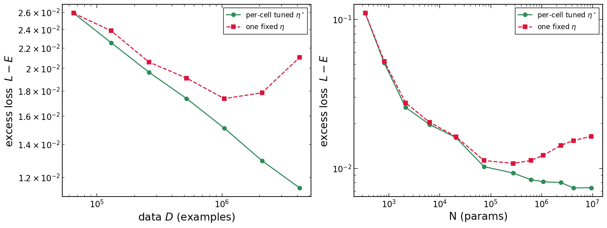
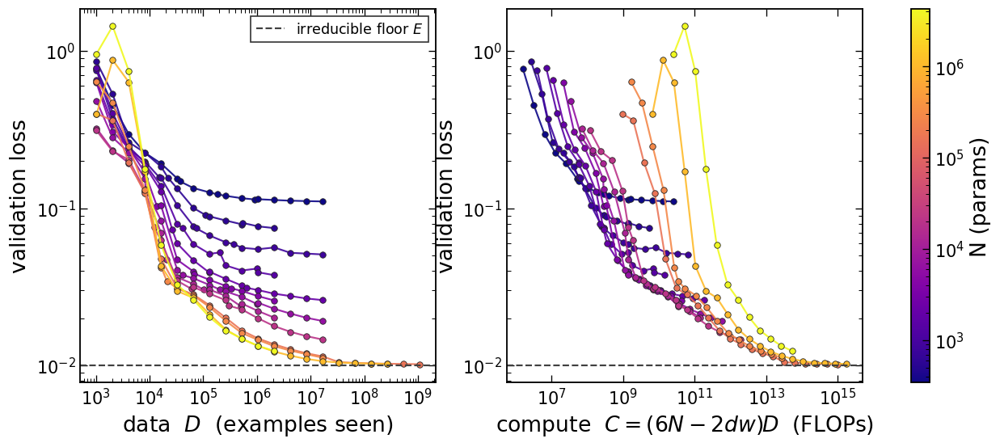
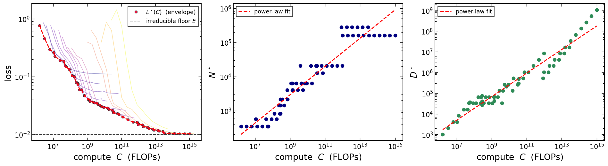
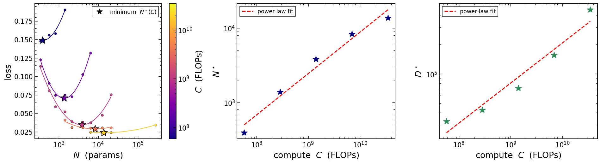
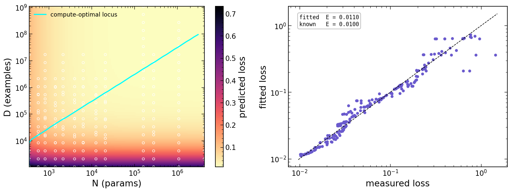
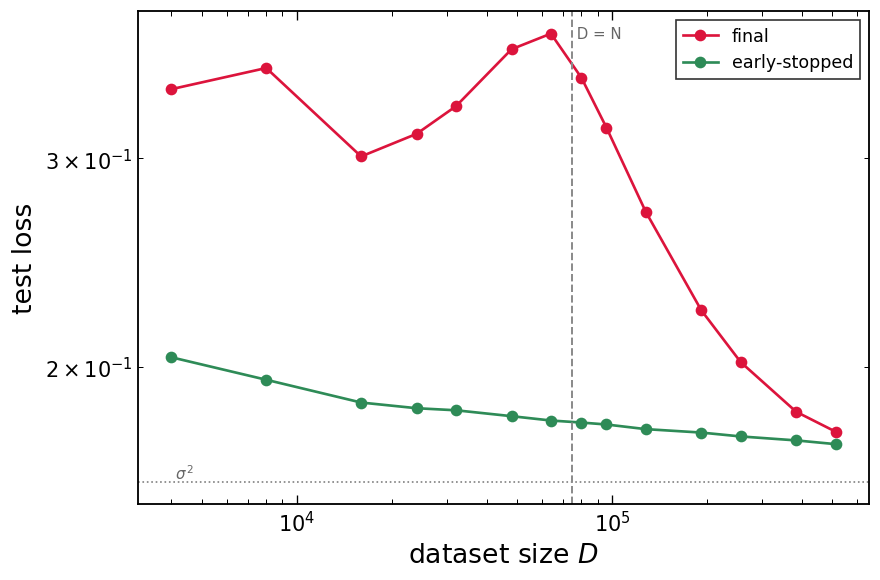
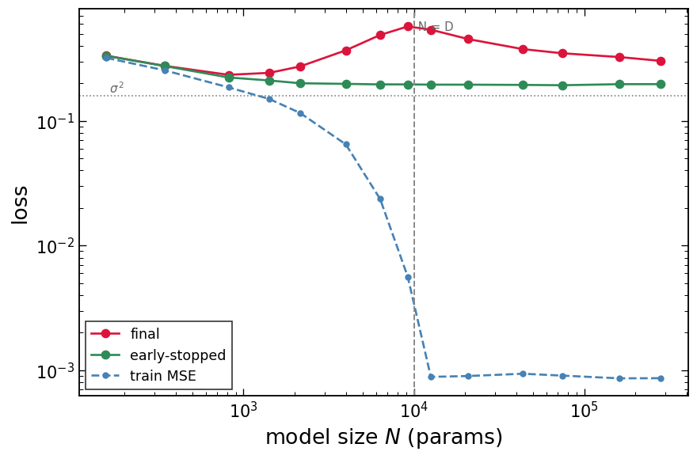
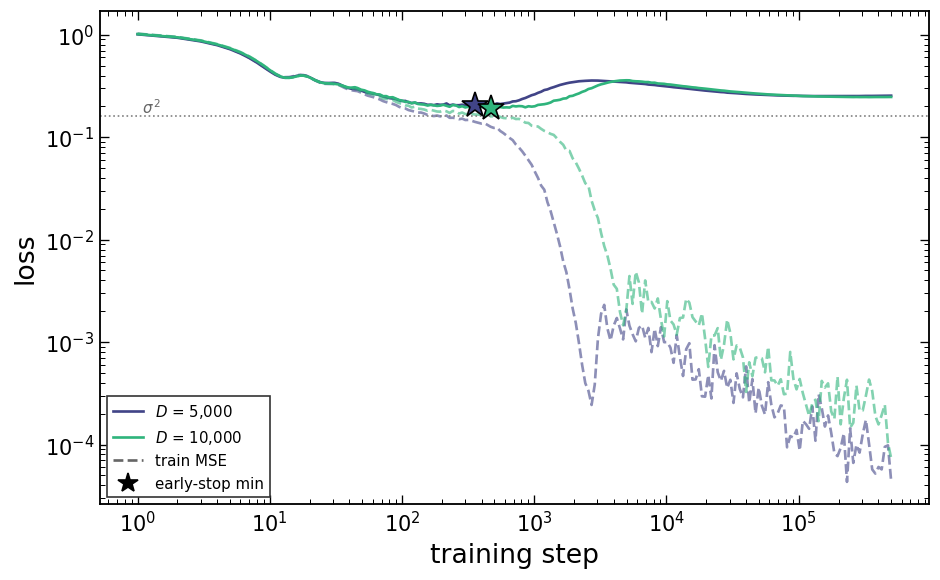
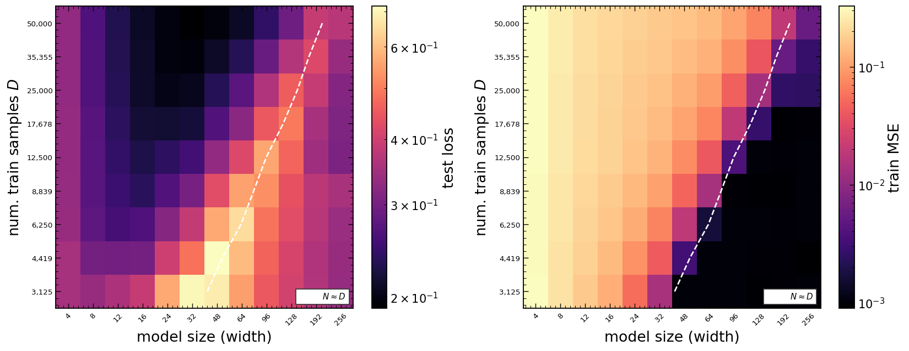

# Extracting neural scaling laws in three ways

This repository is the companion tutorial to Section 4 of the paper

> M. Vigl, N. Pond, J. Barr, A. Froch, D. Guest, N. Hartman, M. Kagan, L. Heinrich,
> *How to scale your HEP ML models: A recipe for robust architecture comparisons at scale*,
> [arXiv:2610.06784](https://arxiv.org/abs/2610.06784) (2026).

It goes through the paper's teacher-student study step by step, on a problem small
enough to run on a laptop: MLP students of increasing size are trained to
imitate a fixed, randomly initialized MLP teacher on Gaussian inputs. From a grid of
training runs over model size `N` and dataset size `D`, it extracts the compute-optimal
scaling law with the three methods of the Chinchilla paper
([Hoffmann et al., 2022](https://arxiv.org/abs/2203.15556)).

## Differences from the paper

The tutorial follows the paper's recipe but simplifies the hyperparameter tuning:

- **Only the learning rate is tuned.** The paper predicts the joint optimum of learning
  rate and batch size, `(η*, b*)`. Here the batch size is fixed at `b = 256` and only `η`
  is tuned.
- **No μP.** The paper uses a μP-based parameterization (Complete(d)P) under which the
  optimal learning rate does not depend on the width or depth of the model. Here `η*` shifts
  with width and depth, and we fit this dependence as a power law.


## What is computed

A scaling law describes how the best achievable loss decreases with training compute `C`
(in FLOPs), and how that compute should be split between model size `N` (parameters) and
data `D` (training examples). We count the training cost of an MLP as
**`C = (6N − 2·d·w)·D`**, where `d` is the input dimension and `w` the width of the first
hidden layer. From the `(N, D)` grid we extract the compute-optimal frontier `L*(C)` and
the allocation `(N*(C), D*(C))` in three ways:

| # | method | idea | output |
|---|--------|------|--------|
| 1 | **Training-curve envelope** | lower envelope of the loss-vs-compute curves | `L*(C)`, `N*`, `D*`, without assuming a functional form |
| 2 | **IsoFLOP profiles** | at fixed `C`, sweep `N`; the `N` with the lowest loss is `N*(C)` | `N*`, `D*` from parabola minima |
| 3 | **Parametric fit** | fit `L(N,D) = E + A/Nᵅ + B/Dᵝ` and derive the frontier in closed form | the full surface and the floor `E` |

## Notebooks

A scaling study is a set of nested loops: train one model, tune its learning rate, predict
the learning rate for every model, train the grid, and fit the frontier. Each notebook adds
one of these loops around the previous one:

| notebook | step | what it does | runs |
|---|---|---|---|
| [`00_single_cell`](notebooks/00_single_cell.ipynb) | one cell | train one model of size `N` on `D` examples and record its loss | live |
| [`01_tune_one_cell`](notebooks/01_tune_one_cell.ipynb) | tune one cell | sweep the learning rate and fit a parabola to find the cell's optimum `η*` | live |
| [`02_hp_transfer_law`](notebooks/02_hp_transfer_law.ipynb) | learning-rate law | fit how `η*` changes with width and step count: `η*(w,T) = η_ref·(w/w_ref)^cᵂ·(T/T_ref)^cᵀ` | small live version, then loads the full study |
| [`03_scaling_analysis`](notebooks/03_scaling_analysis.ipynb) | full sweep | train the `(N,D)` grid with the learning rate from the law and extract the frontier in three ways | loads the grid |
| [`04_double_descent`](notebooks/04_double_descent.ipynb) | repeated data | train repeatedly on a small dataset instead of streaming fresh data, which produces double descent | loads the grids |

The live parts train small models in a few minutes on a CPU; everything else is loaded from
results produced by the scripts in [`scripts/`](scripts/). Each loop is a function in the
package: `sweep.run_cell` (one cell), `hp.tune_lr_cell` (learning-rate sweep),
`hp.fit_transfer_law` (learning-rate law), `sweep.run_grid` (grid) and `approaches.*`
(frontier fits).

## Why every cell needs its own learning rate

A scaling law can only be trusted if every cell of the grid is trained close to its own
optimal learning rate. [`run_lr_ablation.py`](scripts/run_lr_ablation.py) keeps one learning rate fixed while scaling either the data (left) or
the model (right), and compares with cells trained at their own predicted `η*`.



With the fixed learning rate the loss stops improving and eventually increases, while the
tuned runs keep improving. The gap grows with scale, so an exponent read off an untuned
grid is biased, and the scaling can disappear entirely. Notebook 02 therefore calibrates
the law `η*(w,T)` first, and notebook 03 trains every cell at its predicted `η*`.

The same applies in principle to the other hyperparameters, whose optima also move with
model and data size.

## The synthetic problem

- **Teacher**: a fixed, randomly initialized MLP (width 256, two hidden layers) that
  defines the target function. It is never trained. Inputs are Gaussian, `x ~ N(0, I)`, in
  `d = 32` dimensions.
- **Student**: the MLP we train to imitate the teacher. Its width, and therefore `N`, is
  varied.
- **Targets**: `y = teacher(x) + σ·ε` with label noise `ε ~ N(0,1)` and `σ = 0.1`. Fresh
  data is drawn at every step, so every example is seen once and `D` is the number of
  examples seen.

In the parametric form `L ≈ E + A/Nᵅ + B/Dᵝ`, the three terms have a direct interpretation:

- `A/Nᵅ`: a small student cannot represent the teacher (capacity error),
- `B/Dᵝ`: too few examples to determine the function (data error),
- `E`: the label noise, which no model can predict.

Because the task is synthetic, the floor is known exactly, `E = σ² = 0.01`, and the floor
fitted by Approach 3 can be checked against it.

## Quickstart

Install the package, then open the notebooks in order, starting with `00`:

```bash
pip install -e ".[notebook]"        # editable install + jupyter
jupyter notebook notebooks/         # start with 00_single_cell.ipynb
```

Or with [pixi](https://pixi.sh):

```bash
pixi install          # build the environment from pyproject.toml
pixi run notebooks    # execute all five notebooks (00 -> 04)
```

<details>
<summary><b>Optional: regenerate the data</b></summary>

```bash
# 1) Calibrate the learning-rate law eta*(w, T) (~10 min on a CPU).
#    Writes results/hp_study_cosine.json and results/figures/hp_study_cosine.png
python scripts/run_hp_study.py

# 2) Train the (N, D) grid, each cell at its predicted learning rate (~45 min on a CPU,
#    up to D = 17M examples). Cells already in the CSV are skipped, so extending the
#    width or data range only trains the new cells.
#    Writes results/sweep_cosine.csv, results/sweep_meta.json, results/teacher.pt
python scripts/run_sweep.py                 # or --preset quick for a short test run

# 3) Dedicated IsoFLOP runs used by Approach 2 (for every depth family; appended to
#    the sweep CSVs)
python scripts/run_isoflop.py
```
</details>

The expensive training runs live in the scripts, and the analysis notebooks only load
their cached CSVs, so re-running the analysis is fast and deterministic.

## Results



*Loss against compute, one curve per model size. Small models are best at low compute;
larger models take over as compute grows and approach the known floor `E = σ²`.*

| Approach 1: envelope | Approach 2: IsoFLOP | Approach 3: parametric |
|:---:|:---:|:---:|
|  |  |  |

All three approaches find close to `√C` scaling, with `N*` and `D*` growing at about the
same rate (`N* ∝ C^a` with `a` between 0.42 and 0.56). Approach 3 also estimates the floor,
`E = 0.011`, about 10% above the true value of 0.01.

### Double descent

The main tutorial streams fresh data, so no example is repeated, the model never overfits,
and the loss decreases monotonically. Notebook 04 instead trains repeatedly on a fixed
dataset with more label noise (`σ = 0.4`) and reproduces the three kinds of double descent
of [Nakkiran et al., 2019](https://arxiv.org/abs/1912.02292) on the same teacher:

- **Sample-wise** (`--mode samples`, vary `D` at fixed width): the test loss peaks near the
  interpolation threshold `D ≈ N` and then decreases again.
- **Model-wise** (`--mode width`, vary the width at fixed `D = 10k`): a U-shaped curve, a
  sharp peak at `N ≈ D`, and a second descent.
- **Epoch-wise** (`--mode epochs`, fixed overparameterized `W` and `D`, long training): the
  test loss decreases (fitting the signal), increases (fitting the noise) and decreases
  again, while the training MSE decreases monotonically until the model interpolates the
  data.

| sample-wise | model-wise | epoch-wise |
|:---:|:---:|:---:|
|  |  |  |

`--mode grid` sweeps `N` and `D` together. The sample-wise and model-wise curves are cuts
through the resulting phase diagram:



## Citation

If you use this code, please cite the paper:

```bibtex
@misc{vigl2026scalehepmlmodels,
      title={How to scale your HEP ML models: A recipe for robust architecture comparisons at scale}, 
      author={Matthias Vigl and Nikita Pond and Jackson Barr and Alexander Froch and Dan Guest and Nicole Hartman and Michael Kagan and Lukas Heinrich},
      year={2026},
      eprint={2610.06784},
      archivePrefix={arXiv},
      primaryClass={hep-ex},
      url={https://arxiv.org/abs/2610.06784}, 
}
```

## References

Hoffmann, Borgeaud, Mensch et al., *Training Compute-Optimal Large Language Models*
(2022), [arXiv:2203.15556](https://arxiv.org/abs/2203.15556)

Nakkiran, Kaplun, Bansal, Yang, Barak, Sutskever, *Deep Double Descent: Where Bigger
Models and More Data Hurt* (2019), [arXiv:1912.02292](https://arxiv.org/abs/1912.02292)
